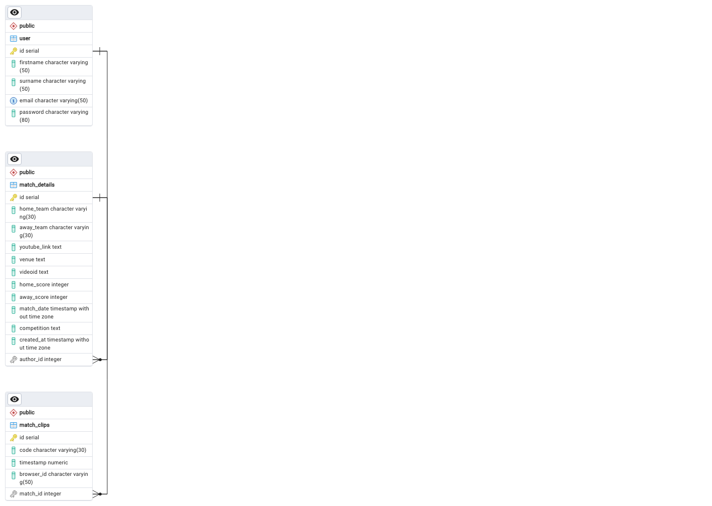

# Rugby Video Analyis Application

Code on [GIT](https://github.com/RossElmes/youtubeplayer)  
Dummy User: johndoe@gmail.com
Dummy Password: password12345

## Background
I used to work previously for a professional rugby team as a video analyst.  This is a big market across all sports world wide.  The main software that is used in called Sportcode by [HUDL](https://www.hudl.com/en_gb/products/sportscode).  A pro license for Hudl costs thousands of pounds an year which for amatuer sports teams is un realistic sum of money to expected to pay to complete analysis. I wanted to create an app that replicates what we can do on hudl to a small scale. 

## Simple Functionality 
The MVP for this app needs to be able to do the following 
- Create a USER
- Login
- Logout
- Upload Match Details
- Take timestamps of certain actions from within the video
- CREATE DELETE match clips from the database
- Seek to a certain part of the match based on a timestamp

## Data Model 
See  for data model.  

## How to Run Locally
Follow the following steps to run locally.
- Download and unzip the project
- Create a virtualenv using `python -m venv venv`
- Activate it source venv/bin/activate
- You would need to update the `DB_URL` env variable to point to a local instance of a database.
- Run the local application with running `pyhton run app.py`

## Creating the Database on Render
To create the database on render I followed [PostgreSQL on Render](https://docs.render.com/databases)

## How I connected to render with Github
To host my application I followed the documents on [Render's Docs](ttps://docs.render.com/github).  

## Leverage the Youtube API
Storing video files is expensive traditionally.  Amaturer clubs will host videos of there games in youtube in unlisted files for post game/match reviews.  This is why I chose tho leverage the youtube IFrame Player API. More info what is possible with the API can be found in the [documentation](https://developers.google.com/youtube/iframe_api_reference)